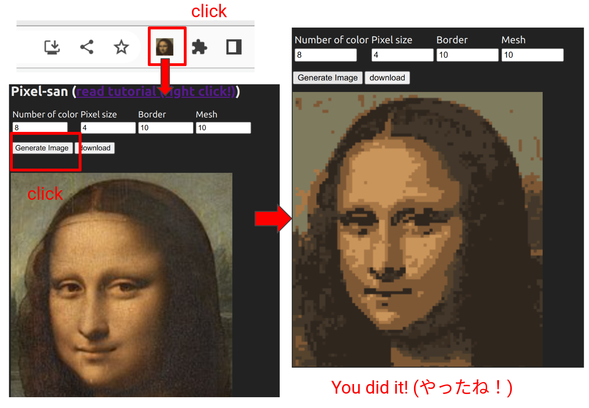
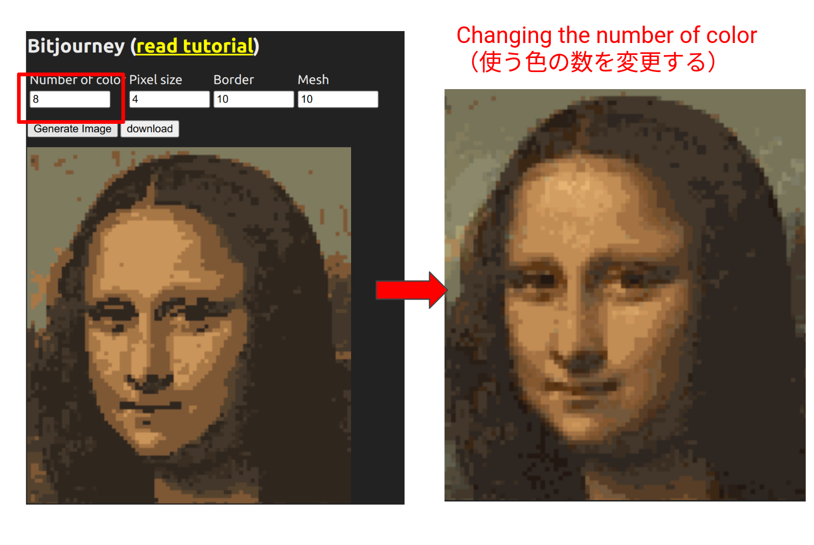
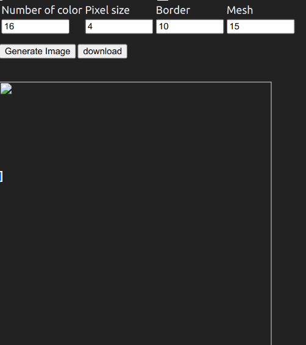
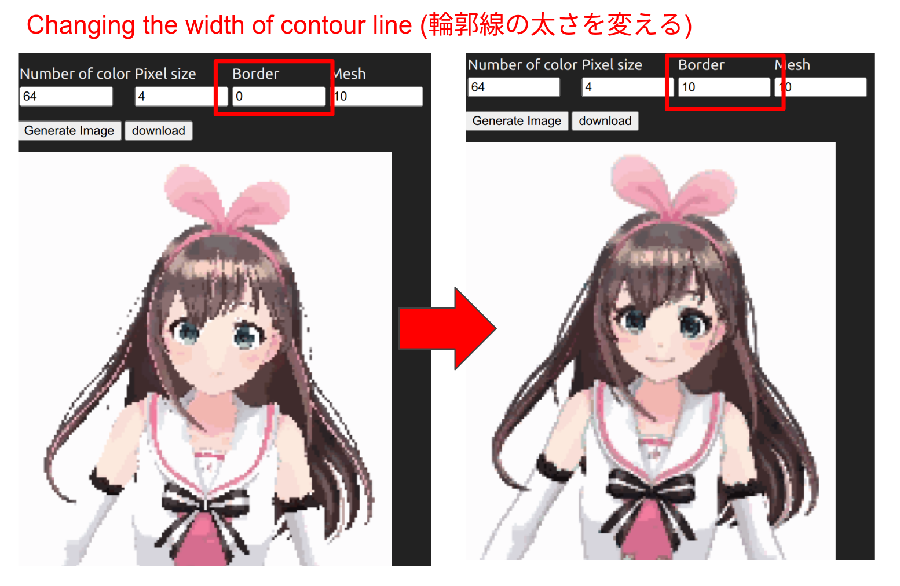
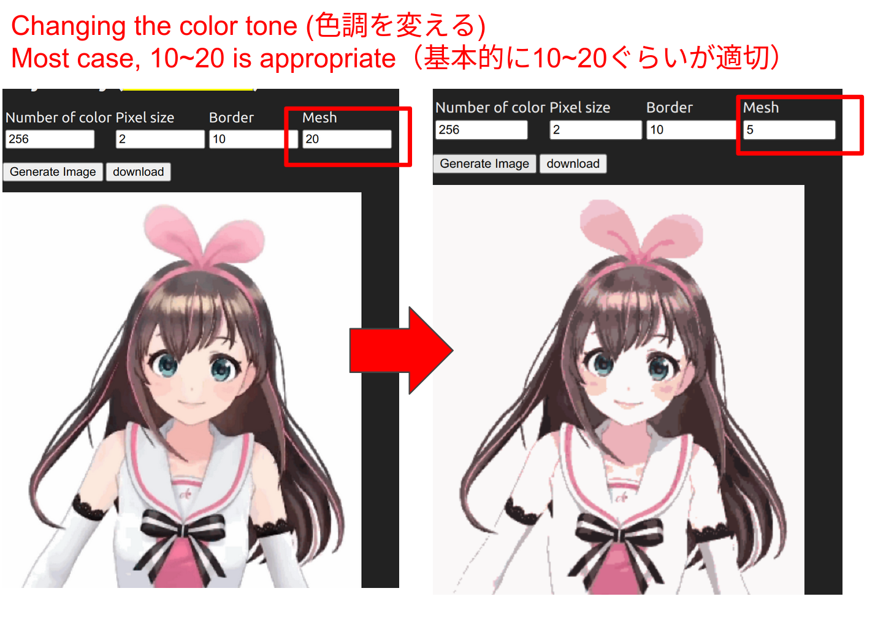

# How to use Pixel-san (Pixel-sanの使い方)

- Pixel-san 0.0.1 and 0.0.2 cannot convert local images. Please wait for 0.0.3 (waiting for approval from chrome web store) or install from this repository.

## Install from chrome web store (chrome web storeからインストールする)
- You can install Pixel-san for chrome extension from [here](https://chrome.google.com/webstore/detail/pixel-san-retro-game-gra/ollneaflfdbmjhadhfbdghlmmheenoii)
- Pixel-san for chrome 拡張は[ここからダウンロードできます](https://chrome.google.com/webstore/detail/pixel-san-retro-game-gra/ollneaflfdbmjhadhfbdghlmmheenoii)

## Let's generate 8 colors Mona Lisa (8色のモナリザを作ってみよう)
- After installing the chrome extension, you will see a Mona Lisa icon in the upper right corner of your browser. Click on it, and a pop-up window will appear as shown below. Click the "Generate Image" button to output an 8-color Mona Lisa.
- chrome拡張をインストールするとブラウザの右上にモナリザのアイコンが出てきます。クリックすると下の図面のようなポップアップが表示されます。「Generate Image」ボタンを押すと8色のモナリザが出力されます。

## Let's change the number of color (使う色の数を変えよう)
- "Number of colors" option changes the number of color used in the generated image. Enter the desired value according to the image you want to reproduce (8 colors for NES, 256 colors for Super NES?). 
- 「Number of color」のオプションを変更することで使う色の数を変えることができます。再現したい画像（ファミコンなら8色、スーパーファミコンなら256色？）に応じて好きな値を入れてください。

## Let's change the resolution (解像度を変えてみよう)
- "Pixel size" option can change the size (resolution) of the mosaic of the output image.
-「Pixel size」のオプションを変更することで出力される画像のモザイクの大きさ（解像度）を変えることができます。

## Let's convert your own image (自分の好きな画像を変換してみよう)
- When you right-click on an image in the chrome browser, you should see the option "Pixel-san : Retro graphics generator". Clicking on it will change the image in the popup to the image you right-clicked on.
- chromeブラウザ上で画像を右クリックすると「Pixel-san : Retro graphics generator」というオプションが表示されるはずです。クリックすることでポップアップに表示される画像があなたが右クリックした画像に変更されます。

- Try right clich!

## When you cannot open image (画像が開けないときは)
- Please right-click the image and click "Open link in new tab". Then you can open the image in a new tab. After that right-click the image in the new tab and click "Pixel-san : Retro graphics generator". 
- 画像を右クリックして「新しいタブで画像を開く」をクリックすることで、画像を新しいタブで開くことができます。新しく開いたタブ側の画像を右クリックして「Pixel-san : Retro graphics generator」をクリックしてみてください

- You will see invalid image when Pixel-san failed to open the image

## When you cannot open image even in the new tab (上記の方法で解決しないときは)
- Please save the image into your computer and open the image using google chrome. After that right-click the image opened by google chrome and click "Pixel-san : Retro graphics generator". 
- 画像を自分のパソコンに一旦保存し、保存した画像をgoogle chromeで開いてください。google chromeで開いた画像を右クリックして「Pixel-san : Retro graphics generator」をクリックしてください

## Let's modify the coutour line (輪郭線の太さを調整しよう)
- In low-resolution images, contour lines are sometimes smashed. In such cases, try setting the "Border" value to 10 (other values can be taken, but basically 10 behaves best. When you set the value to 0, contour lines will not be modified).
- 解像度の低い画像では輪郭線が潰れてしまうことがあります。そういうときは「Border」の値を10にしてみましょう（10以外の値も取れますが、基本的に10が最も良い挙動をします。0にすると輪郭線の太さの調整は行われません）

## Let's modiry color tone (色調を調整しよう)
- Mesh option can adjust the color tone of the image. Basically, a value of 10~20 is often optimal, but reducing this value may improve the color tone. The larger the value, the longer it takes to calculate, so do not set the value higher than 30.
- 「Mesh」を調整すると色調を変えることができます。基本的に10~20ぐらいの値が最適であることが多いですがこの値を減らすことで色調が良くなることがあります。大きくするほど計算時間がかかります。30よりも大きい値にはしないでください。

# License (ライセンス情報)
- Images used as examples are from the Japanese version of wikipedia. Kizuna AI images (and images converted by Pixel-san) are licensed under CC BY-SA 3.0. © Kizuna AI, SCP Foundation., CC BY-SA 3.0
- 本資料で使われている画像は、wikipediaの日本語版から引用しています。キズナアイの画像（およびPixel-sanで変換した画像）は、CC BY-SA 3.0ライセンスで提供されています。© Kizuna AI, SCP Foundation., CC BY-SA 3.0